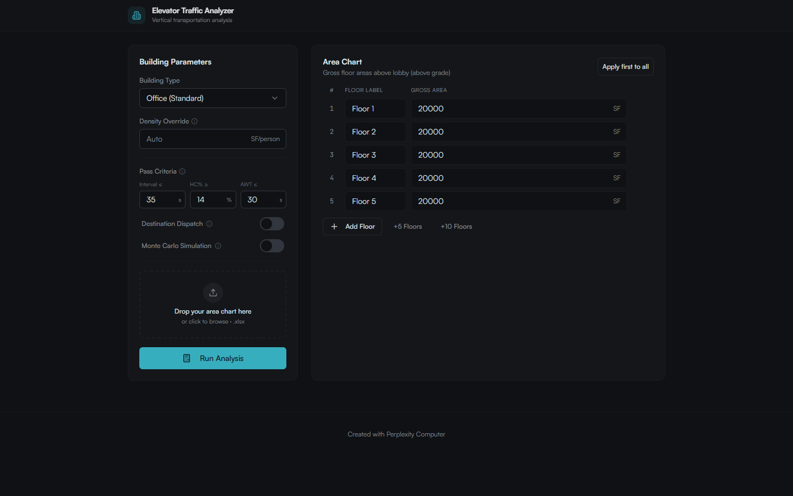
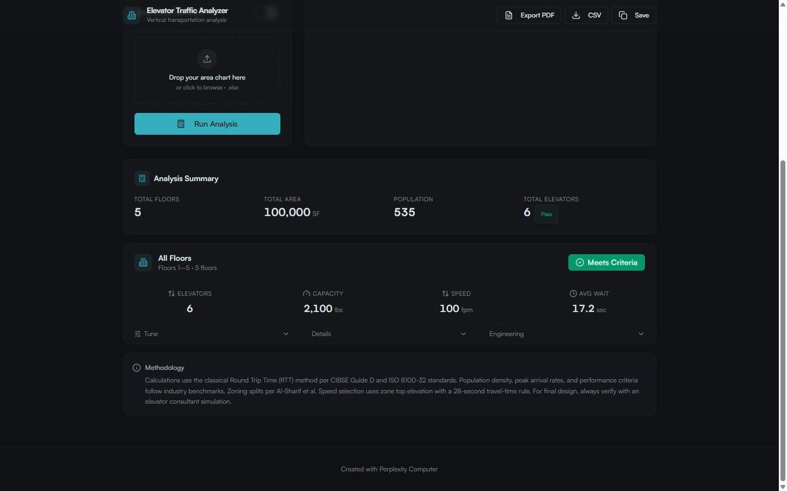
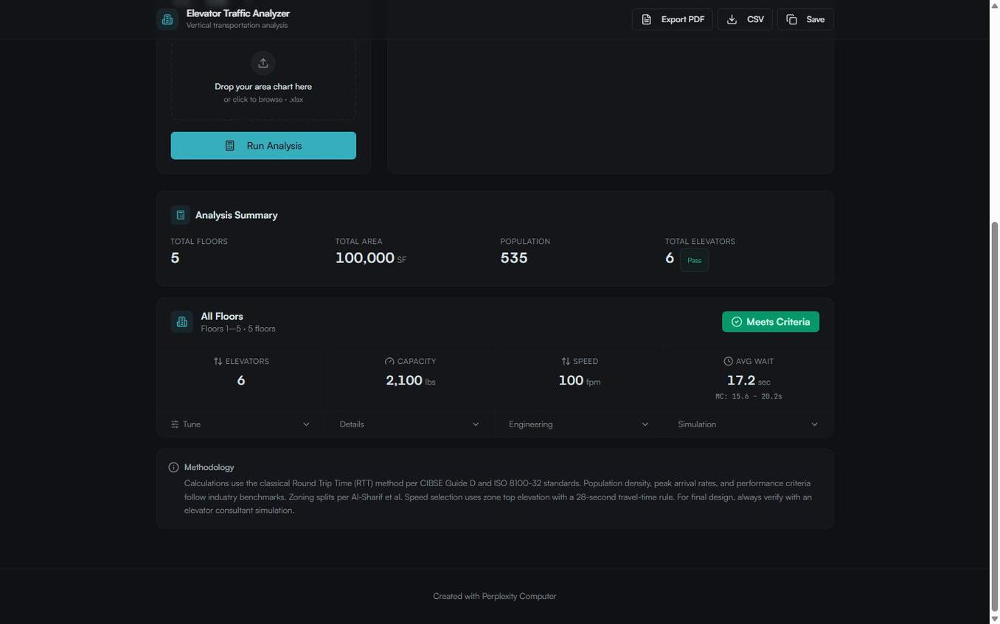

# Elevator Traffic Analyzer

**A free, web-based vertical transportation analysis tool for early-stage building design.**

Architects, developers, and engineers can use this app to determine how many elevators a building needs, what size and speed they should be, and whether the design meets industry wait-time standards — all before engaging an elevator consultant.

**[Try the live app →](https://my-elevator-consultant.vercel.app)**



---

## What It Does

Enter your building's floor areas (or upload an architect's area chart spreadsheet), select a building type, and the engine will:

- **Calculate population demand** from gross floor areas using BOMA net-to-gross ratios and industry density standards
- **Zone the building** into elevator banks automatically (Al-Sharif population-split method) or from spreadsheet-defined zones
- **Back-solve for the minimum number of elevators** that satisfy interval, handling capacity, and average wait time criteria simultaneously
- **Select elevator speed and capacity** from ASME A17.1 standard platforms using travel-height rules
- **Estimate structural loads** (pit reactions, machine beam loads, shaft dimensions) for early coordination with structural engineers
- **Estimate electrical requirements** (motor HP, kVA, feeder sizing, disconnects) per NEC Article 430
- **Run Monte Carlo simulations** (1,000 trials) to produce P10/P90 confidence intervals on wait times, validating the deterministic results



## Building Types Supported

| Type | Density | Arrival Rate | Max Interval | Max AWT |
|------|---------|-------------|--------------|---------|
| Office (Standard) | 135 SF/person | 12% | 35 s | 30 s |
| Office (Prestige) | 175 SF/person | 13% | 33 s | 22 s |
| Hotel | 250 SF/person | 11% | 35 s | 25 s |
| Residential | 350 SF/person | 6.5% | 60 s | 42 s |
| Hospital | 120 SF/person | 10% | 35 s | 35 s |
| Ballroom / Event | 10 SF/person | 25% | 40 s | 40 s |

## Monte Carlo Simulation

Toggle on Monte Carlo mode to run a probabilistic analysis alongside the deterministic calculation. Each trial samples random passenger counts (Poisson-distributed) and destination floors (population-weighted CDF), computing a full RTT for each sample. The result is a distribution of wait times with P10 and P90 bounds — useful for understanding real-world variability that a single deterministic number can't capture.



## Import & Export

- **Excel import** — Drop in an architect's area chart (.xlsx) and the parser auto-detects floor levels, areas, floor-to-floor heights, zones, and density overrides
- **Excel export** — Download the area chart data back to .xlsx
- **PDF export** — Generate a professional single-page landscape report suitable for including in design packages

## Methodology

The calculation engine follows the classical Round Trip Time (RTT) methodology from **CIBSE Guide D: Transportation Systems in Buildings**. Key references:

- CIBSE Guide D (2020) — Transportation Systems in Buildings
- Dr. Albert So — "Fundamentals of Traffic Analysis" (Elevator World)
- Al-Sharif et al. — "Zoning a Building in Lift Traffic Design"
- Peters Research — "Lift Planning for High-Rise Buildings"
- Wang Sheng et al. — "Elevator Traffic-Flow Prediction Based on Monte Carlo Method" (Elevator World)
- ASME A17.1 / CSA B44 — Safety Code for Elevators and Escalators
- NEC Article 430 — Motors, Motor Circuits, and Controllers

A detailed methodology document is included in the repo: **[Methodology Synopsis (PDF)](docs/Elevator_Traffic_Analyzer_Methodology.pdf)**

## Tech Stack

- **Frontend:** React, TypeScript, Tailwind CSS, Recharts, shadcn/ui
- **Backend:** Express (Node.js)
- **Computation:** All analysis runs client-side in the browser — no server calls needed for calculations
- **Hosting:** Vercel

## Running Locally

```bash
git clone https://github.com/Eric-Meller/elevator-traffic-analyzer.git
cd elevator-traffic-analyzer
npm install
npm run dev
```

The app will be available at `http://localhost:5000`.

## Disclaimer

All values are planning-level estimates intended for early-stage architectural design coordination. Results should be verified by a qualified elevator consultant during detailed design. This tool is not a substitute for a professional traffic analysis.

## License

MIT
